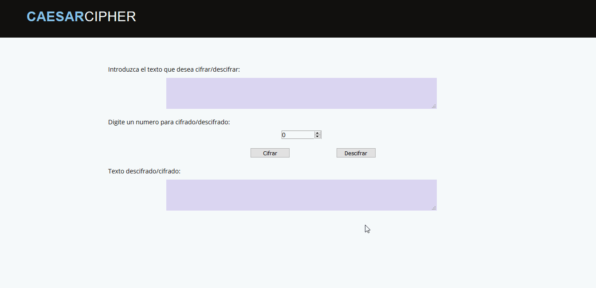

# Caesar Cipher APP

## Introducción

Esta aplicación cifra mensajes del usuario con uno de los cifrados más conocidos, "CIFRADO CESAR". Estos mensajes no son entendibles a simple vista para ello, esta aplicación también te ayuda a descifrar los mensajes.

## DEMO 

## Preámbulo

Si tu mamá no para de leer tus mensajes de WhastApp, de Facebook, de Instragram, de Twitter, hasta te encuentra en Tinder. Usa esta app, para cifrar tus mensajes privados, tu nombre en tinder, tus textos de amor, lo que sea que quieras ocultar y compártelo con tus amigos para que lo descifren con el **shift** que usaste.

## Información

### Contenido y Características

* Información
* Pasos para usar la aplicación
* Cifrador / Descifrador

## Instalación

Entra a la aplicación web aquí -> <https://vbiaggi10.github.io/lim-2018-05-bc-core-pm-cipher/src/>

## Tecnologías usadas

La aplicación está estructurada utilizando html, css,javascript.

## Cifrado Cesar

El [cifrado César](https://en.wikipedia.org/wiki/Caesar_cipher) es uno de los
primeros métodos de cifrado conocidos históricamente. Es un tipo de cifrado por
sustitución en el que una letra en el texto original es reemplazada por otra
letra que se encuentra un número fijo de posiciones más adelante en el alfabeto.

El emperador Julio César lo usaba para enviar órdenes a sus generales en los
campos de batalla, es una de las técnicas más simples y más usadas para cifrar
un mensaje.

Por ejemplo si usáramos un desplazamiento de 3:

* Alfabeto sin cifrar: A B C D E F G H I J K L M N O P Q R S T U V W X Y Z
* Alfabeto cifrado: D E F G H I J K L M N O P Q R S T U V W X Y Z A B C

Actualmente todos los cifrados de sustitución alfabética simple, se descifran
con facilidad y en la práctica no ofrece mucha seguridad en la comunicación,
pero el cifrado César muchas veces puede formar parte de sistemas más complejos
de codificación, como el cifrado Vigenère, e incluso tiene aplicación en el
sistema ROT13.